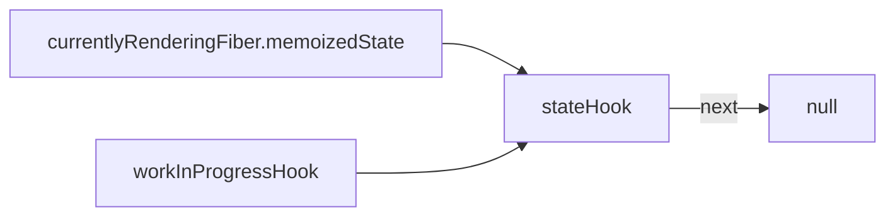
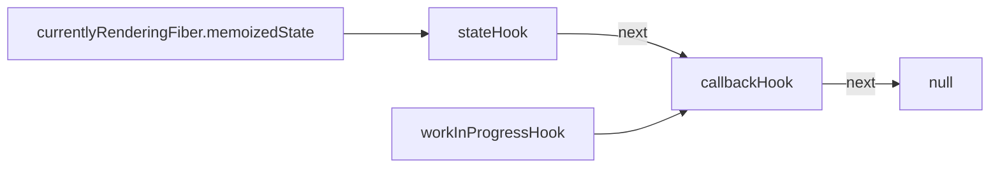
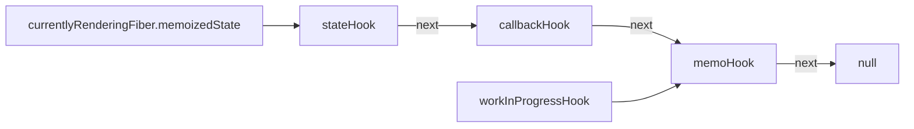
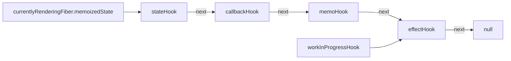
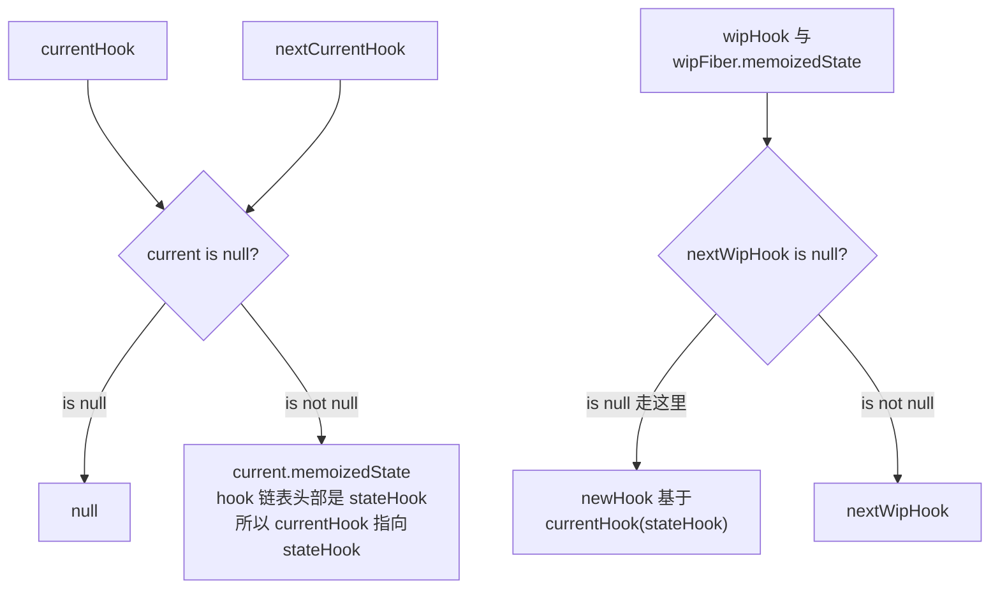
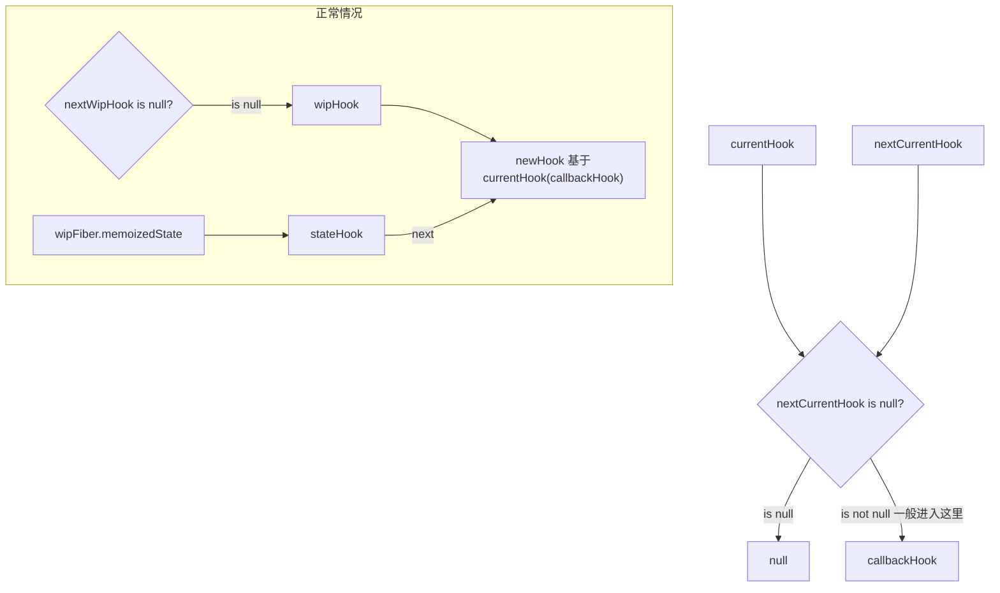
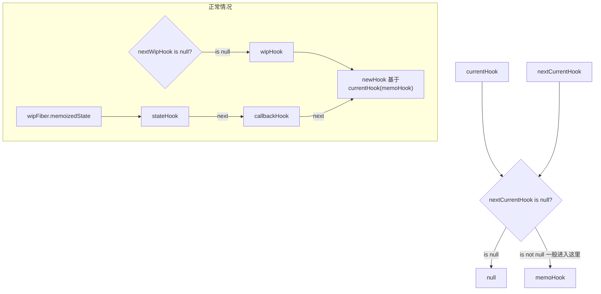
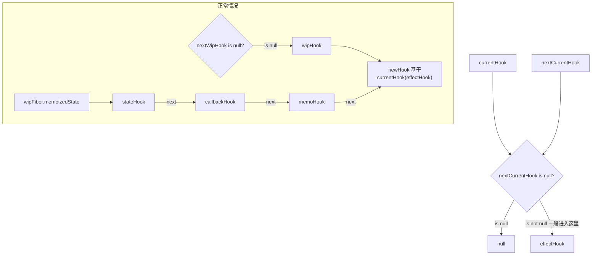

参考：

- [https://github.com/lizuncong/mini-react/blob/master/docs/hooks/%E5%BD%BB%E5%BA%95%E6%90%9E%E6%87%82%E5%87%BD%E6%95%B0%E7%BB%84%E4%BB%B6hook%E9%93%BE%E8%A1%A8.md](https://github.com/lizuncong/mini-react/blob/master/docs/hooks/%E5%BD%BB%E5%BA%95%E6%90%9E%E6%87%82%E5%87%BD%E6%95%B0%E7%BB%84%E4%BB%B6hook%E9%93%BE%E8%A1%A8.md)

相关内容：

- [[Hook 对象]]
- [[Fiber 对象]]

首先有几个注意点：

> [!important] 无论挂载还是更新，函数组件都会执行 位于
> 
> `ReactFiberHooks.js` 中的 `renderWithHooks` 这个函数;
> 
> 在这个函数内部，将会把 wipFiber 中的 memoizedState, updateQueue 设置为 null 也就是说，==**函数组件的 hook 对象链表每次都是重新构建的**==
> 
> 期间会用到两个全局变量进行辅助，`currentHook` 和 `workInProgressHook` , workInProgressHook 将会指向 wipFiber 现在正在构建的 hook 对象；currentHook 将会指向 workInProgressHook 的 current 版本；
> 
> ```js
> function App() {
> 	const [bool] = useState(true);
> 	const [int] = useState(1); // 假设正在构建这个 hook 对象
> 	return ...
> }
> ```
> 
> ```mermaid
> flowchart TB
> 	FiberRootNode --current--> current
> 	subgraph wip [wip]
> 		HostRoot2[HostRoot] --child--> App2[App] --memoizedState--> boolHook2[boolHook] --next--> intHook2[intHook] --next--> null2[null]
> 	end
> 	subgraph current [current]
> 		HostRoot1[HostRoot] --child--> App1[App] --memoizedState--> boolHook1[boolHook] --next--> intHook1[intHook] --next--> null1[null]
> 	end
> 	current --alternative --> wip
> 	wip --alternative--> current
> 	workInProgress --> intHook2
> 	currentHook --> intHook1
> ```

> [!important]
> 
> `currentlyRenderingFiber` 也是一个全局变量，其实就是 `wipFibe`, `renderWithHooks` 函数会把 `currentlyRenderingFiber` 赋值为 `wipFiber`

下面的解释中，都使用下述代码：

```js
function App() {
  const [count, setCount] = useState(0);

  const handleClick = useCallback(() => {
    setCount((prev) => prev + 1);
  }, []);

  const value = useMemo(() => {
    return count * count;
  }, [count]);

  useEffect(() => {
    console.log('useEffect');
  }, []);

  return <div>
    <div>
      <button onClick={handleClick}>click</button>
    </div>
    <p>{count}</p>
    <p>{value}</p>
  </div>
}
```

## 挂载

挂载的时候执行位于 `ReactFiberHooks.js` 中的 `mountWorkInProgressHook` 函数

```js
function mountWorkInProgressHook(): Hook {
  const hook: Hook = {// 直接初始化一个 Hook 对象
    memoizedState: null,
    baseState: null,
    baseQueue: null,
    queue: null,
    next: null,
  };
	// 当 workInProgressHook 为 null 时说明是第一个 hook，将 currentlyRenderingFiber.memoizedState 赋值为 hook 指向 Hook 链表的头
	// 而 workInProgressHook 永远指向正在创建的 Hook 对象
  if (workInProgressHook === null) {
    // This is the first hook in the list
    currentlyRenderingFiber.memoizedState = workInProgressHook = hook;
  } else {
		// 使用 workInProgressHook 构建链表；
    // Append to the end of the list
    workInProgressHook = workInProgressHook.next = hook;
  }
  return workInProgressHook;
}
```

第一个 hook(useState) 执行:



第二个 hook(useCallback) 执行:



第三个 hook(useMemo) 执行:



第四个 hook(useEffect) 执行:



该组件执行完成之后，在 `renderWithHooks` 中 将 `workInProgressHook` 置为 null

## 更新

更新的时候执行位于 ReactFiberHooks.js 中的 `updateWorkInProgressHook` 函数

```js
function updateWorkInProgressHook(): Hook {
  let nextCurrentHook: null | Hook;
	// currentHook 为 null 表示是组件的第一个 hook
  if (currentHook === null) {
    const current = currentlyRenderingFiber.alternate;
    if (current !== null) {
			// 先指向 current 的 Hook 链表的头部
      nextCurrentHook = current.memoizedState;
    } else {
			// current 为 null 可能是新增的组件
      nextCurrentHook = null;
    }
  } else {
    nextCurrentHook = currentHook.next;
  }

  let nextWorkInProgressHook: null | Hook;
	// wipHook 为 null 表示是组件的第一个 hook，开始连接 Hook 链表
  if (workInProgressHook === null) {
		// 这里的 wipFiber.memoizedState 正常情况下来说也应该是 null
    nextWorkInProgressHook = currentlyRenderingFiber.memoizedState;
  } else {
    nextWorkInProgressHook = workInProgressHook.next;
  }

	// 如果 nextWorkInProgressHook 不是 null 那么说明链表已经开始连接了；那么移动 wipHook 和 currentHook 的指向
  if (nextWorkInProgressHook !== null) {
    // There's already a work-in-progress. Reuse it.
    workInProgressHook = nextWorkInProgressHook;
    nextWorkInProgressHook = workInProgressHook.next;

    currentHook = nextCurrentHook;
  } else {
    // Clone from the current hook.

    if (nextCurrentHook === null) {
      throw new Error('Rendered more hooks than during the previous render.');
    }

    currentHook = nextCurrentHook;
		
		// 创建一个 Hook 对象，但是复用上次的内容
    const newHook: Hook = {
      memoizedState: currentHook.memoizedState,

      baseState: currentHook.baseState,
      baseQueue: currentHook.baseQueue,
      queue: currentHook.queue,

      next: null,
    };

    if (workInProgressHook === null) {
      // This is the first hook in the list.
			// wipFiber.memoizedState 指向链表头部
      currentlyRenderingFiber.memoizedState = workInProgressHook = newHook;
    } else {
      // Append to the end of the list.
      workInProgressHook = workInProgressHook.next = newHook;
    }
  }
  return workInProgressHook;
}
```

> [!important] 下面的流程图，只考虑正常情况，包括<br>1. 第一次执行时， wipFiber.memoizedState 为 null，因为在执行函数组件前就将其置为了 null<br>2. 第一次执行时，currentHook 与 wipHook 应该为 null，因为在每次函数执行完后 renderWithHook 都会吧这个全局变量置为 null<br>

第一次执行：



第二次执行：



第三次执行：



第四次执行：



可以发现 wipFiber.memoizedState 连接完成；